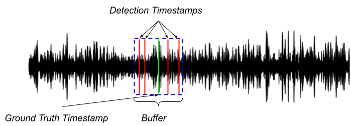

+++
title = 'Task 1 : Supervised sound detection with strong labelling'
date = 2024-05-20T14:45:28-03:00
draft = false
showDate = false
+++

## User scenario 

The model benchmark produced in this task should provide evidence-based answers to the following user needs:

“ I have developed a detection model showing a 99% accuracy and 99 % recall on my study site and my target whale species, recorded during last winter. And now, I would like to implement it onboard a mobile platform to monitor the same species year-round over a wider spatial area.

Doing so, I will NOT have access to the new recorded data at all! Will my model be able to keep the same level of performance ? Is my model choice OK or should I transition to another one ? ”

## Task setup

This is a classical supervised sound event detection task using strong labeling. This task aims to challenge and assess the ability of models to adapt and perform in varying acoustic environments, reflecting the real-world variability encountered in marine mammal monitoring. Also, to force the model to be species and dataset agnostic, two subtasks are proposed below.

## Evaluation metrics

A True Positive (TP) is recorded when a detection timestamp intersects with a ground truth buffer. A False Positive (FP) is incremented when a detection timestamp does not overlap with any ground truth buffer. Finally a False Negative (FN) is noted when there is a ground truth event that does not have a corresponding detection timestamp.

Note: The true positive count will only be incremented once per detection timestamp. For instance if multiple detection timestamps aligns with only one ground truth, the true positive count will be incremented only once. Similarly, if one detection timestamp aligns with multiple ground truths, the true positive count will be incremented for each ground truth.

The following images illustrates these scenarios:

In the image above, several detection timestamps are indicated by red lines, all of which fall within the same ground truth buffer marked by a green line and a blue box. Under this scenario, the count of true positives will be incremented only once, despite multiple detections.

In the image above, a single detection timestamp (red line) intersects with several ground truth buffers (blue boxes). In this case, the count of true positives will be incremented for each ground truth that the detection timestamp overlaps, despite there being "only one" detection.

Note that those metrics will be averaged over all labels, but the score per label will also be computed and report. Besides, the length of the buffer has been set differently for the two subtasks.

## Task rules and submission

Participants are free to employ any preprocessing technique and network architecture. The onyl requirement is that the final output of your model MUST be a CSV file formatted following the annotation format of evaluation set described above. A 1.5-second buffer will be applied, where detections within this range from the annotation will be considered a true positive. Please see the examples in this page for a more in depth discussion on how to provide the timestamps.

Official challenge submission consists of:

- System output file (*.csv)
- Metadata file (*.yaml)
- Technical report explaining in sufficient detail the method (*.pdf)

System output should be presented as a single text-file (in CSV format, with a header row as shown in the example output below). 

